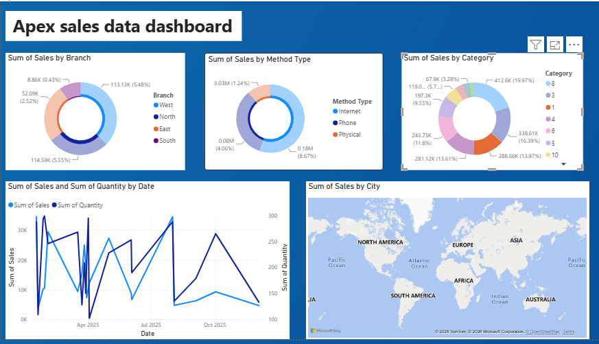

# 📊 Apex Sales Dashboard | Power BI

An interactive Power BI dashboard developed to analyze Apex sales data and provide business insights through dynamic visualizations, KPIs, and geographic analysis.

---

# 📌 Project Overview

The Apex Sales Dashboard enables business users to monitor sales performance across branches, sales methods, product categories, and cities. The dashboard provides an intuitive interface for exploring trends, comparing performance, and supporting data-driven decision making.

---

# 🎯 Business Objective

The objective of this project is to:

- Analyze sales performance across different branches.
- Compare sales generated through different sales methods.
- Understand category-wise sales contribution.
- Monitor sales and quantity trends over time.
- Identify geographical distribution of sales.

---

# 🛠️ Tools & Technologies

- Microsoft Power BI
- Power Query
- DAX (Data Analysis Expressions)
- Microsoft Excel

---

# 📂 Dataset

**Dataset:** Apex Sales Data

The dataset contains information such as:

- Sales Amount
- Quantity Sold
- Branch
- Method Type
- Category
- City
- Order Date

---

# 📈 Dashboard Features

### 📌 KPI & Visual Analysis

- Branch-wise Sales Distribution
- Method Type-wise Sales Analysis
- Category-wise Sales Analysis
- Monthly Sales & Quantity Trend
- City-wise Sales Map
- Interactive Filters for Data Exploration

---

# 📊 Dashboard Visuals

✔ Donut Chart – Sales by Branch

✔ Donut Chart – Sales by Method Type

✔ Donut Chart – Sales by Category

✔ Line Chart – Sales vs Quantity Trend

✔ Map – Sales by City

---

# 💡 Business Insights

- Compare sales contribution across different branches.
- Analyze customer purchasing methods (Internet, Phone, Physical).
- Identify top-performing product categories.
- Track monthly sales and quantity trends.
- Visualize city-wise sales using an interactive map.
- Support business decisions with real-time visual insights.

---

# 📷 Dashboard Preview



---

# 📁 Repository Structure

```
PowerBI-Sales-Dashboard
│
├── README.md
├── Sales Dashboard.pbix
├── Apex.xlsx
└── Download.png
```

---

# 🚀 Future Enhancements

- SQL Database Integration
- Automated Data Refresh
- Sales Forecasting
- Advanced KPI Dashboard
- Customer Segmentation Analysis

---

# 👩‍💻 Author

**Priyanka Kandgule**

**Data Analyst | SQL | Power BI | Excel | Python | MySQL**

